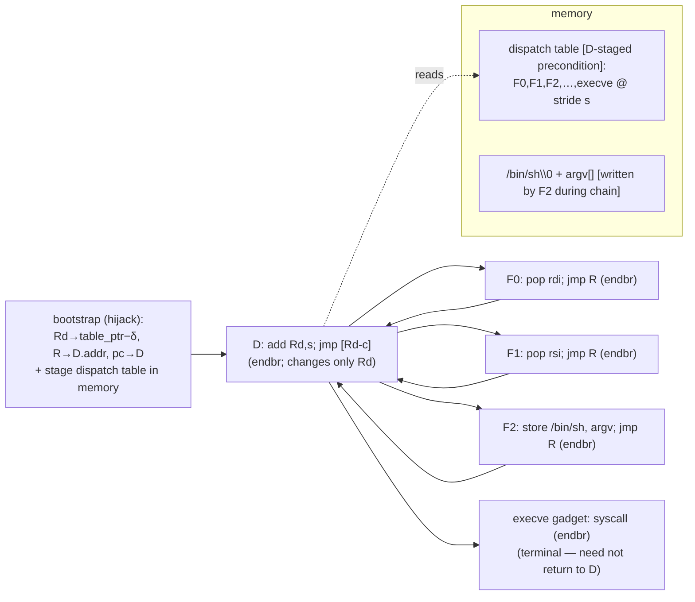

# Ret-free (CET-resistant) JOP/COP engine for angrop

## Implementation checklist

Implement phases in order; **each phase ends with its own tests green before starting the next.**
The legacy stack/`ret` path must stay default and inert (C0) throughout.

- [ ] **Phase 0 — Foundation:** CET detect, `endbr` tagging, IBT enforcement, plumb `cet=`.
      Files: `arch.py`, `rop_gadget.py`, `gadget_finder/gadget_analyzer.py`, `gadget_finder/__init__.py`,
      `rop.py`. Contracts: **C0, C1, C2, C7**.
- [ ] **Phase 1 — Classification + harder-tier extensions:** dispatcher + functional-gadget
      detection/predicates; JOP gadget discovery (`only_check_near_rets=False` P4, `fast_mode=False` P8);
      **plus the harder-tier extension** — COP post-call-continuation analysis (C10, **builder-level**,
      reuses `analyze_gadget`). (C11 pivot needs **no** `gadget_analyzer` change — spike-confirmed
      builder-only; see Spike-results callout.) Files: `rop_gadget.py`, `gadget_finder/gadget_analyzer.py`
      (dispatcher classification only), `gadget_finder/__init__.py`. Contracts: **C3, C8**
      (classification side), **C10** (extension side), **C11** (builder-side filter).
- [ ] **Phase 2 — Core refactor:** generalize `_build_reg_setting_chain` (transit flag),
      add `JopChain` + effect-cached `FunctionalBlock`. Files: `rop_chain.py`, `rop_block.py`,
      `jop_chain.py` (new), `builder.py`. Contracts: **C0, C4, C5**.
- [ ] **Phase 3 — JOP/COP builders (whole API):** swap `self_contained`→`is_functional`, reuse the
      giga-graph search across the data plane (`set_regs`, `move_regs`, `write_to_mem`, `add_to_mem`/
      `mem_*`, `do_syscall`/`execve`) + COP `func_call` + JOP `pivot`/`shift`; `shstk`⇒JOP routing.
      Files: `reg_setter.py`, `reg_mover.py`, `mem_writer.py`, `mem_changer.py`, `sys_caller.py`,
      `func_caller.py`, `pivot.py`, `shifter.py`, JOP orchestrator (new `chain_builder/jop_setter.py`).
      Contracts: **C6** (build), **C8** (selection), **C9**, **C10** (COP), **C11** (pivot/shift).
- [ ] **Phase 4 — Validation gate:** `JopChain.verify()` fails closed. File: `jop_chain.py`.
      Contracts: **C6, C8, C9, C10, C11** (check side).
- [ ] **Phase 5 — Test binary + tests:** synthesized `-fcf-protection=full` target + suite.
      Files: `tests/jop_target.c`, `tests/build_jop_target.sh`, `tests/test_cet.py`. Mirrors **all** contracts.

### Contract → test mapping

| Contract | What it guarantees | Test (in `tests/test_cet.py` unless noted) |
|---|---|---|
| **C0** | legacy path unchanged when CET off / `transit==STACK` | full `pytest tests/` passes unchanged + assert JOP branches gated on `arch.ibt`/JOP mode |
| **C1** | `apply_cet` truth table; `addr_has_endbr` pure/total; `ibt ⇒ endbr_bytes` | `test_apply_cet_*`, `test_addr_has_endbr_total`, `test_ibt_implies_endbr` |
| **C2** | every gadget gets `has_endbr: bool`; `has_endbr ⇒ endbr_bytes`; survives pickle | `test_gadget_has_endbr`, `test_has_endbr_after_load_gadgets` |
| **C3** | `is_dispatcher` structural fields; `is_functional(R,Rd)` predicate | `test_dispatcher_detect`, `test_is_functional_truth_table` |
| **C4** | functional block effect == `ret`-twin effect; no branch deps | `test_functional_block_effect_equiv` |
| **C5** | STACK postcondition identical; JOP postcondition ⇒ C6 | `test_build_chain_stack_regression`, `test_build_chain_jop_postcond` |
| **C6** | no *unbalanced* `pop_pc`, all targets `endbr`, `R`/`Rd` preserved, stride match, **branch-free path + single-successor stepping**, `exec()`→ requested primitive's goal state | `test_jop_set_regs_*`, `test_jop_write_mem_*`, `test_jop_syscall_*`, `test_jop_execve_end_to_end`, `test_jop_no_conditional_branch` |
| **C7** | **legacy-path** IBT (consecutive-pair); NOT the JOP gate (that's C6.2) | `test_check_ibt_pass`, `test_check_ibt_violation_raises` |
| **C8** | dispatcher register-transparency (`changed_regs⊆{Rd}`, no mem-write, `R≠Rd`, `R∉D.changed_regs`) | `test_dispatcher_transparency_reject`, `test_dispatcher_transparency_accept` |
| **C9** | under `shstk`: methods route to JOP & never emit `pop_pc`; table is precondition not chain-written | `test_shstk_no_ret_chain`, `test_table_is_precondition` |
| **C10** | COP `func_call` call-gadget: target+gadget `endbr`, `R`/`Rd` callee-saved, balanced `call`/`ret` | `test_jop_func_call_cop`, `test_cop_requires_callee_saved` |
| **C11** | JOP `pivot`/`shift`: functional sp-control (`jmp R`, no `ret`), preserves `R`/`Rd`, new `rsp` staged | `test_jop_pivot`, `test_jop_shift` |

## Context

angrop builds ROP/JOP chains on top of angr. Today it is **structurally `ret`-based** and
**blind to Intel CET**:

- Every chain enters and advances via the stack: `RopChain.exec` does
  `state.regs.pc = state.stack_pop()` (`rop_chain.py:182`); `_build_reg_setting_chain`
  begins with `test_symbolic_state.ip = test_symbolic_state.stack_pop()`
  (`builder.py:374-380`) and uses the symbolic stack as the data + control channel.
- `RopGadget.self_contained` is *defined* as `transit_type == 'pop_pc'`
  (`rop_gadget.py:27-34`); only such gadgets seed the reg-setter graph (`reg_setter.py:110`)
  and can become a `RopBlock` (`RopBlock.from_gadget` asserts `pop_pc`, `rop_block.py:91`).
- `jmp_reg`/`jmp_mem` gadgets are only ever *normalized back into* stack/`ret` chains
  (`builder._normalize_jmp_reg` / `_normalize_jmp_mem`), and there is **no** CET / IBT /
  `endbr` / dispatcher logic anywhere in the repo.

The goal: a JOP/COP engine that emits **`ret`-free** chains that survive **Intel CET**
(IBT + shadow stack), **generalizing angrop's chain-building API** to a ret-free transit — not a
single primitive. Because every builder funnels through `_build_reg_setting_chain`, making that
choke point JOP-capable lifts the whole API at once.

### Scope: which primitives (v1)

> **Cost classes (feasibility pass + spike — see the Spike-results callout below; UPDATED 2026-06-19).**
> (1) the **data plane**, JOP `shift`, **and `pivot`** need *no* gadget-analyzer changes; they are
> "swap the `self_contained` filter for `is_functional`" because angrop already discovers
> `pop/mov/store/rmw/syscall/add rsp,X … ; jmp R` gadgets — and the pivot spike confirmed
> `mov rsp,reg; jmp R` already classifies as a `PivotGadget` retaining `transit_type=='jmp_reg'`.
> (2) **COP `func_call` (C10)** needs a **builder-level** extension (compute the post-call address and
> re-run the existing `analyze_gadget` on it — no `gadget_analyzer` *internals* change); the spike
> confirmed `endbr; call rax` is discoverable as a `jmp_reg` gadget. angrop treats `call` as a terminal
> stopping state (it stops at the call's unconstrained successor), which is exactly why the post-call
> continuation must be re-analyzed. So the **only** gadget-analyzer change left is dispatcher
> classification (Phase 1). (Separately verified, a
> non-issue worth recording: angrop's `has_symbolic_access()` already **excludes** a `jmp_mem` gadget's
> defining PC read from its symbolic-access count — `num_sym_mem_access` subtracts it,
> `rop_effect.py:182-193` — so a pure dispatcher `add Rd,s; jmp [Rd-c]` is **not** filtered out; the JOP
> path only needs to ensure `D` has no *other* symbolic memory access, which the canonical shape doesn't.)

> **Spike results (empirically verified 2026-06-19 — both harder tiers de-risked below this estimate).**
> Ran the COP and pivot classification spikes on a `-fcf-protection=full` binary with the exact gadget
> shapes (`endbr; call rax[; jmp R]`, `endbr; mov rsp,rax; jmp R`, `xchg rsp`, `add rsp,X; jmp R`),
> classified with `ROP(cet=True, fast_mode=False)`:
> - **COP (C10) is confirmed Class 2 (builder-only).** `endbr; call rax` classifies cleanly as
>   `RopGadget transit_type='jmp_reg' pc_reg='rax'` with `stack_change=-0x8` and `mem_writes=1` (the
>   pushed return address) — the `call`'s mem-write/negative stack-change survive `_create_gadget`, and
>   the `Ijk_Call` jumpkind does **not** block `jmp_reg` classification. `endbr; call rax` and
>   `endbr; call rax; jmp R` give *identical* results (the trailing `jmp R` is invisible — analysis
>   stops at the call's unconstrained successor), confirming the two-piece G1/G2 model. The G2
>   continuation re-analyzes via the existing `analyze_gadget` to `jmp_reg pc_reg=R, has_endbr=False`
>   (correct — G2 is reached by `ret`, not an indirect branch).
> - **Pivot (C11) collapses to builder-only — the `gadget_analyzer` change is NOT needed.**
>   `endbr; mov rsp,rax; jmp R` already classifies as a `PivotGadget` that **retains
>   `transit_type=='jmp_reg'`, `pc_reg=R`** with `sp_reg_controllers={'rax'}`. The feared
>   `transit_type→None` only occurs when the IP itself comes from the pivoted stack (ctrl_type=='pivot',
>   e.g. `mov rsp,rax; ret`); a JOP pivot takes its IP from an independent register, so ctrl_type is
>   `'register'` and the transit stays `jmp_reg`. So C11 pivot reduces to **bypassing the
>   `transit_type!='jmp_reg'` filter at `pivot.py:120` + the `is_functional` check** — same as `shift`.
> - **New pitfall found & fixed — `fast_mode` (P8).** `fast_mode` filters out **all** jmp-terminated
>   gadgets and auto-enables on large binaries; widening the scan for JOP makes the binary look larger,
>   so the functional pool would silently come back empty. Phase 0 now forces `fast_mode=False` under
>   `shstk` (warn if forced on). The plan's P4 only covered `only_check_near_rets`.
>
> Net effect: the only genuine `gadget_analyzer` change left for Phase 1 is **dispatcher classification**
> (`is_dispatcher` on `jmp_mem` gadgets) plus the `is_functional`/`is_dispatcher` predicates; COP keeps
> its post-call-continuation **builder** extension, and pivot/shift are builder-only filter changes.

- **Data plane — core JOP (all naturally ret-free; swap-the-filter, no analyzer change):** `set_regs`,
  `move_regs`, `write_to_mem`,
  `add_to_mem` + `mem_xor`/`mem_and`/`mem_or`/`mem_add`, `do_syscall` (ANY syscall, with/without
  return), and `execve` (a `do_syscall` convenience). These are functional gadgets routed by the
  dispatcher; `execve` is just one end-to-end validation target.
- **Calls — COP tier (v1; needs a builder extension):** `func_call` to real functions. Under shadow
  stack a function reached by a `jmp` faults on its own `ret`; the fix is **COP** — a *call-gadget*
  table entry (`endbr; call rax`) whose pushed return frame lets the callee's `ret` validate and resume
  at a **post-call continuation** (`…; jmp R`) → dispatcher. **angrop stops analysis at the `call`**, so
  this needs a bounded extension (analyze the post-call address as the continuation; implements the
  existing `_func_call_gadgets` TODO). `R`/`Rd` must be **callee-saved** so they survive the call (C10).
- **Stack-data plane — `pivot` / `shift` (v1, JOP form; both builder-only — spike-confirmed no analyzer
  change).** In JOP, `rsp` is *only* the pop-data pointer (control flows through the
  dispatcher, not `rsp`), so manipulating `rsp` is a plain register write — **no `ret`, hence feasible
  under shadow stack**. `pivot` = relocate `rsp` to an attacker-controlled data region via a *functional*
  sp-control gadget (`pop rsp ; jmp R`, `mov rsp, reg ; jmp R`, `xchg rsp, reg ; jmp R`) that preserves
  `R`/`Rd` — spike-confirmed these already classify as `jmp_reg` `PivotGadget`s (the analyzer's
  `jmp_reg`/stack-pivot exclusion only bites when the IP comes from the pivoted stack, which JOP never
  does, C11). `shift` = advance `rsp` by a *constant* (`add rsp, X ; jmp R`) to
  skip/realign pop-data — a constant sp delta is invisible to pivot detection, so it is already a
  `jmp_reg` functional gadget and needs **no** analyzer change (builder-only). Useful when the initial pop-data
  region is small/uncontrolled (e.g. pivot to a staged heap buffer). The existing `Pivot` path is
  ROP-only — it *excludes* `transit_type=='jmp_reg'` (`pivot.py:120`) and emulates `pop pc`; the JOP
  path instead **includes** functional sp-control gadgets and routes through the dispatcher. A pivot
  introduces an additional staged pop-data region as a precondition (the new `rsp` target).
- **Deferred to future work (documented, not in v1):**
  - `sigreturn`/SROP — **defeated by shadow stack**: Linux CET gates `sigreturn` on a shadow-stack
    *restore token* the attacker cannot forge (cannot write the shadow stack), so `sigreturn` faults
    before returning. (The blocker is `sigreturn` itself, not later `ret`s — which JOP already avoids.)
  - `retsled` — **no JOP analog**: it is inherently a sled of `ret`s; the dispatcher/table has no
    "land anywhere and converge" equivalent.

### The two facts that make this tractable

1. **`pop` is allowed under CET; only `ret` faults.** Shadow stack validates *returns*,
   not stack reads. So a functional gadget `pop rdi ; jmp R` still pulls `rdi` from the
   ordinary stack — only the *control transfer* must avoid `ret`. **angrop's symbolic-stack
   data channel is therefore reused as-is; only the inter-gadget glue changes.**
2. **The glue becomes a dispatcher + table.** The standard, buildable JOP model:
   - a **dispatcher gadget** `D` of the form `add Rd, s ; jmp [Rd - c]` — it advances the table
     pointer `Rd` by a fixed stride `s` and jumps through the next table entry. **`D` must be
     register-transparent:** it changes only `Rd` (and flags) and writes no memory, so it does not
     disturb the register/memory state the functional gadgets build up (see P2/C8). Its memory
     read address, expressed in terms of the *initial* `Rd`, is `Rd + δ` (for `add Rd,s; jmp[Rd-c]`,
     `δ = s − c`); `δ` is extracted directly from `pc_target`.
   - **functional gadgets** `F_i` that do work and end in `jmp R`, where `R` is a register holding
     `D`'s address, preserved across all `F_i` **and across `D`** (so `R ∉ D.changed_regs`, `R ≠ Rd`);
   - a **dispatch table** holding `[F0, F1, …]` at stride `s`. **The table is part of the attacker-
     staged initial memory (a precondition), not written by the chain** — the chain cannot run before
     `D` reads `table[0]` (see P1). Only the *data* (`/bin/sh`, `argv/envp`) is written during the chain.
   - **Entry is `D`**, with `Rd_init = table_ptr − δ` so the first dispatch reads `table[0] = F0`.
     Control flow: `D → (jmp [table[0]]) → F0 → (jmp R) → D → (jmp [table[1]]) → F1 → …`. Every
     transfer is an indirect branch to an `endbr` target — no `ret`.
     *Worked trace* (lock the off-by-one): `add rbp,8; jmp [rbp-8]` ⇒ `s=8, c=8, δ=s−c=0`,
     `Rd_init=table_ptr`. Visit 0: `rbp 1000→(add)1008→ jmp [1008-8]=[1000]=table[0]`. Visit 1:
     `rbp 1008→1016→ [1008]=table[1]`. (The read uses `rbp` *after* the `add`; `pc_target` already
     encodes that, since it is expressed in terms of the entry-`rbp`: `pc_target = sreg_rbp + δ`.)

### Honest preconditions (documented, not hidden)

A fully `ret`-free chain needs an **attacker-staged bootstrap** that a stack overflow alone
cannot supply. In real CET exploitation this comes from the hijacked indirect call/jmp site plus
the memory-corruption primitive. The engine produces a chain **parameterized by that bootstrap**
and surfaces it explicitly. The bootstrap consists of:
- **Initial registers:** `Rd = table_ptr − δ`, `R = D.addr`, and any input regs the first
  functional gadget expects.
- **Staged memory — the dispatch table** (`[F0, F1, …]` at stride `s` at `table_ptr`). **This is a
  precondition, NOT written by the chain (P1):** the chain cannot execute before `D` reads
  `table[0]`. The engine emits the table bytes for the attacker to place.
- **Entry pc = `D`** (an `endbr`, so the hijacked indirect branch is itself IBT-legal).
- **Stack data** for the `pop`s (ordinary stack, allowed under CET).

Everything else — the `/bin/sh` string and `argv/envp` arrays — *is* written during the chain by
functional store gadgets (consumed only at the terminal `execve`). All code pointers in the table
and in the initial registers are emitted rebased (`base + offset`) for PIE.

**Threat-model divergence from ropbot (NDSS'26) — stated, not hidden.** The paper's threat model
(§II.A) assumes the attacker "control[s] **only** the payload placed on the stack," and it
*explicitly distances itself* from prior tools that additionally assume the attacker "knows the
location of the payload" or "can … set arbitrary memory values … before executing the chain"; it
also assumes "backward-edge CFI (e.g., PAC, CET) is **absent**." Our JOP/COP engine necessarily adopts a
**stronger attacker model**, because defeating the shadow stack via JOP intrinsically requires it:
(i) **CET present** — the paper itself notes that handling shadow stacks "would require modification
of ropbot," and *this work is that modification*; (ii) **initial register control** of `Rd`/`R`
(supplied by the hijacked indirect branch); (iii) **dispatch-table staging** at a known address —
which is precisely the "knows the location / sets memory before execution" assumption the paper
avoids. (ii)+(iii) are the classical JOP threat model (Bletsch et al.), not a fixable shortcoming.
This is a **deliberate, documented relaxation** of ropbot's model — not a violation of its
definitions. **The legacy ROP path is unchanged and stays within ropbot's original stack-only,
CET-absent model (C0).** We also rely on **IBT being coarse-grained** (any `endbr` is a legal
indirect target, so a hijack to `D`/`F0` is permitted). The paper remarks that "if both a shadow
stack and CFI are deployed, control-flow hijacking will become impossible"; it does not discuss CFI
granularity — that distinction is **our** observation: deployed IBT is coarse-grained, so an indirect
hijack to *some* `endbr` remains possible and the paper's "impossible" holds only against *fine-grained*
forward-edge CFI.

### Performance: preserving the RopBlock advantage (must-have, not nice-to-have)

angrop is fast because its search **never re-executes**. `find_candidate_chains_giga_graph_search`
(`reg_setter.py:474`) builds a graph where nodes = "which regs are set" and edges = gadgets/blocks
**labeled by precomputed effect attributes** (`popped_regs`, `changed_regs`, `concrete_regs`,
`reg_moves`, `stack_change`). Pathfinding is pure graph theory over those cached fields — no
symbolic execution. RopBlocks are fast because they are effect-analyzed **once** (`_analyze_effect`)
and then act as edges identical to gadgets (`_reg_setting_dict`, `reg_setter.py:99,115,129`).
Symbolic execution happens only (a) once per block at build time and (b) once per *final candidate*
chain (`_build_reg_setting_chain` + `verify()`).

The JOP design keeps this property intact because the **"pop still works" insight** means a
functional gadget `pop rdi ; jmp R` has the **same register/stack effect** as `pop rdi ; ret` —
transit type changes control flow only, which the effect graph abstracts away. The subtlety
(below) is that we reuse only the *effect-analysis* role of RopBlock, **not** its composition role.

> **`FunctionalBlock` is deliberately NOT a `RopBlock`.** The paper's *formal* ROPBlock definition
> (§II.B) is, verbatim: "a ROPBlock if and only if it • has a positive stack change (thus having a
> stack patch), • takes the PC from the stack patch, and • does not conditionally branch." (The code
> docstring `rop_block.py:13-20` adds one implementation hygiene condition: no memory accesses outside
> the stack patch.) The conditions are referenced **by name** below to avoid the code-vs-paper
> numbering difference. The **takes-PC-from-the-stack-patch** condition *is* the `ret`/`pop_pc`
> mechanism, so no RopBlock can be ret-free, and `RopBlock.__add__`/`next_pc_idx` compose blocks by
> overwriting that on-stack PC slot. A `FunctionalBlock`:
> - **rejects takes-PC-from-the-stack-patch** — PC comes from the dispatcher register `R`, not the
>   stack (the whole point);
> - **does NOT require positive-stack-change** — that condition exists only to reserve the on-stack PC
>   slot; a functional gadget needs no such slot and may have `stack_change == 0` (e.g.
>   `mov rax, rbx ; jmp R`) or negative; requiring it would wrongly drop valid functional gadgets;
> - **keeps no-conditional-branch** (the one hard inherited condition; C3/C6.5). It does **not** inherit
>   the no-out-of-stack-patch-access hygiene either — functional store gadgets write the `/bin/sh`/argv
>   data region and the dispatcher reads the table, both out-of-patch; such accesses are constrained by
>   the existing builder machinery exactly as in the ROP path.
> It is therefore a **separate class**, never routed through `RopBlock.from_gadget` (whose `pop_pc`
> assert it would violate) or `RopBlock.__add__`.
>
> **Chainability substrate.** A ROPBlock's defining property is *guaranteed chainability via the
> stack patch* (paper §II.B: "loads the PC from the stack patch … guaranteed to be chainable with
> any other ROPBlock"). A `FunctionalBlock` provides the analogous guarantee on a **different
> substrate** — *guaranteed chainability via the dispatcher table* (each ends in `jmp R`, so any
> functional block is reachable as the next table entry). Same design goal ("guaranteed
> chainability"), different mechanism. The paper instead turns `jmp_reg`/`jmp_mem` gadgets *back
> into* ROPBlocks via normalization (`_normalize_jmp_reg`); the legacy path keeps that (C0), and JOP
> adds this second substrate.
>
> **Soundness boundary (rule compliance):** we do **not** reuse the paper's ROPBlock stack-composition
> chainability guarantee for JOP, and must not claim it. We reuse only the *transit-agnostic effect
> analysis*; JOP-chain correctness is established **independently** by `JopChain.verify()` (C6,
> fail-closed). The paper's O(n) register-setting search is untouched — the same graph search runs;
> functional gadgets merely populate its edges (different transit, identical effect semantics).

RopBlock bundles two separable roles; the JOP path keeps the first and replaces the second:
- **Role 1 — effect abstraction (KEEP):** the cached effect attributes that let a unit be a graph
  edge. `FunctionalBlock` runs the **same `_analyze_effect` pipeline** as `RopBlock`
  (`_compute_sp_change`, `_check_reg_changes`, `_check_reg_change_dependencies`, `_check_reg_movers`,
  `_check_pop_equal_set`, `_analyze_concrete_regs`, `_analyze_mem_access`, **and `_cond_branch_analysis`**
  — the last is required so `branch_dependencies`/`has_conditional_branch` are populated for C4). These
  helpers operate on init/final states and are **transit-agnostic**. Only the entry (`ip = addr`) and
  terminal-IP handling (`jmp R`) differ from `RopBlock`.
- **Role 2 — composition (REPLACE):** RopBlock chains via the `next_pc` stack slot. `FunctionalBlock`s
  compose via the **dispatch table** (append their gadget addresses at stride `s`) inside JOP-mode
  `_build_reg_setting_chain`/`JopChain` — never via stack-slot overwrite. The data they `pop` still
  comes off the ordinary stack, read out exactly as today.

Therefore:

- **`FunctionalBlock` must be a first-class, effect-cached unit** that reuses the transit-agnostic
  effect-analysis (Role 1) and exposes the same effect attributes, so it slots into the **same**
  graph search as an edge. Its entry is `ip = gadget.addr` (no `stack_pop()`), its terminal transit
  is `jmp R` (unconstrained), and its composition is table-based (Role 2). This is the hard
  requirement that keeps JOP as fast as ROP.
- The dispatcher is **transparent to the search** — but only because we *enforce* the conditions
  that make it so (P2/C8): `D.changed_regs ⊆ {Rd}` (+ flags), `D` writes no memory, `R ∉ D.changed_regs`,
  `R ≠ Rd`. With those, `D` cannot disturb the register/memory state the functional gadgets build, so
  it never needs to participate in pathfinding. A dispatcher violating these is rejected at selection.
- JOP is potentially **cheaper per edge** than today's `jmp_reg` path: currently `jmp_reg` gadgets
  are gated out of the graph (`reg_setter.py:551`, `not g.self_contained`) and must go through the
  expensive `_normalize_jmp_reg` (`builder.py:665`, a full `_build_reg_setting_chain`+`sim_exec` per
  candidate pc-setter). In JOP mode the dispatcher is the universal glue, so functional gadgets are
  **direct edges with no normalization** — that expensive path disappears.

Bounded, confined extra costs:
1. Final-chain symbolic exec steps through the dispatcher between functional gadgets (~1 small bbl
   per gadget, per *candidate* chain) — a modest constant factor on an existing step, not on search.
2. Functional gadgets are relative to a chosen `(D, R, Rd)`; fix one dispatcher and build the
   functional `_reg_setting_dict` once (same cost structure as ROP). Multiple viable dispatchers →
   retry, but each retry is a *smaller* search (functional pool ⊆ pop pool). Rank dispatcher
   candidates, try best-first.

The honest trade-off is **coverage, not speed**: the functional pool is smaller, so some registers
may be unsettable directly and lean on the existing reg-move optimization (`_optimize_with_reg_moves`)
or another dispatcher. This is binary-dependent — exactly why we verify against a synthesized binary
built to contain the needed gadget shapes.

#### Time-complexity verification (vs. ropbot's O(n) bound)

Paper notation (verified against the text): the formally-bounded result is **register setting**, with
graph **build `O(N)`** where **`N` = number of gadgets/blocks** and **solve `O(2^{2k})`** where **`k` =
number of registers** (nodes `= 2^k`, shortest path `O(V²)`); `k` small/constant ⇒ solve negligible ⇒
register setting is `O(N)`. The paper makes **no** formal claim beyond register setting (mem/syscall/
function-call/pivot are described operationally, built on the register-setting primitive). Verdict:
**the JOP/COP engine stays within these bounds.** Component by component:

- **Register-setting search — `O(N_f)` per (dispatcher, R) candidate, identical class to the paper.**
  The graph abstraction is unchanged (nodes `= 2^k` register-control states; edges = blocks labeled by
  cached effect attributes; no symbolic execution in the search loop). `FunctionalBlock`s are valid
  edges because they inherit the paper's **unconditional-chainability** invariant on a different
  substrate (dispatcher table instead of stack patch). So build is `O(N_f)` over the functional pool
  `N_f ⊆ N`, solve is the same `O(2^{2k})`. The filter swap (`self_contained`→`is_functional`) is
  `O(1)`–`O(k)` per gadget — preprocessing, no asymptotic change. `k` stays small/constant (incl.
  `func_call` args ≤ 6), so `O(2^{2k})` remains negligible.
- **The one *added* dimension — dispatcher/`R` selection.** `is_functional` is relative to `(R, Rd)`,
  so the search is rerun per `(D, R)` candidate. `#R` is a constant (≤ #GP regs ≈ 15); `#D` (dispatcher
  gadgets) is binary-dependent and `≤ N`. **Best-first** ⇒ expected first candidate succeeds, i.e.
  expected `O(N_f)`. Worst case (infeasible binary, all candidates tried) is `O(#D · #R · N_f)`, i.e.
  up to `O(N²)` *only if* `#D` grows with `N` and every candidate fails — **never exponential**. We keep
  the register plane at `O(N)` by **capping dispatcher candidates at a constant `N_D`** (top-ranked
  best-first); this cap is a design decision, made explicit here and in the orchestrator (Phase 3 §1).
- **Discovery — matches the paper's own model, not a regression.** ropbot "exhaustively analyzes all
  executable addresses." Our `only_check_near_rets=False` *restores* exactly that exhaustive scan
  (angrop's near-ret default is a *narrower* optimization); cost is the paper's discovery cost,
  one-time and cached (`save_gadgets`/`load_gadgets`), independent of `k`. Per-gadget effect analysis is
  `O(1)` (one bounded `sim_exec`) ⇒ `O(N)` one-time. COP adds one `analyze_gadget(post_call_addr)` per
  call-gadget ⇒ `O(#call_gadgets)` one-time preprocessing (each bounded by the 3 s timeout).
- **Build/verify — `O(L)`**, `L` = chain length (bounded; shortest path ≤ `2^k` edges + mem/syscall
  sub-goals). Dispatcher interleaving `D→F₀→D→F₁…` doubles the steps ⇒ constant factor 2, same class as
  ropbot's chaining (empirically 0.4–2.5 s).
- **We *avoid* the paper's documented slow path.** ropbot normalizes `jmp_reg`/`jmp_mem` gadgets
  (prepend a ROPBlock) and conditional gadgets (prepend constraint-setting) via symbolic execution +
  state forking (its measured cost: gadget-finding 32 s→238 s with conditionals). The JOP path uses
  `jmp_reg` functional gadgets as **direct edges** (dispatcher provides chainability — no prepend) and
  **excludes** conditional gadgets (`is_functional` requires `not has_conditional_branch`). So per-edge
  cost is **≤** ropbot's normalized per-edge cost — complexity-neutral-to-favorable.
- **COP / pivot / shift.** `func_call` sets ≤ 6 args via the same `O(N_f)` search (COP continuation is
  preprocessing); `pivot` selects from the small pivot pool, each candidate at most an `O(N_f)`
  set_regs; `shift` is a constant-`stack_change` `jmp_reg` selection. These live in the same
  `O(N)`-per-sub-goal regime the paper uses for its own Invocation pseudo-gadget — the paper sets no
  formal bound here, so there is none to exceed.

**Bottom line:** the only complexity dimension JOP/COP adds over ropbot is the dispatcher/`R` outer
loop, which is `1×` in the common best-first case and a **bounded constant** (`N_D · #R`) by policy —
so the register-setting bound remains `O(N)` (paper-equivalent), discovery matches the paper's
exhaustive model, and we shed the paper's normalization cost. No step is exponential in `N`; `k`
remains the only exponent and stays small/constant exactly as in the paper.

## Implementation (phased)

### Phase 0 — CET detection, `endbr` tagging, IBT enforcement (foundation)

*Arch (`angrop/arch.py`):*
- `ROPArch.__init__`: add `self.ibt = False`, `self.shstk = False`, `self.endbr_bytes = None`.
- `addr_has_endbr(self, addr)`: exact-byte compare of `loader.memory.load(addr, len)` to
  `self.endbr_bytes` (guard `KeyError`→False).
- `apply_cet(self, cet)`: `True`→force on; `False`→force off; `None`→`self._detect_cet()`.
  Warn once if `shstk` ("shadow stack present → engine will build ret-free JOP"), info if `ibt`.
- `_detect_cet`: base no-op; `X86`/`AMD64` override parses the `GNU_PROPERTY_X86_FEATURE_1_AND`
  (`0xc0000002`, IBT=`0x1`, SHSTK=`0x2`) note via `struct`, defensively (`try/except`→defaults).
  `X86.endbr_bytes=b"\xf3\x0f\x1e\xfb"`, `AMD64.endbr_bytes=b"\xf3\x0f\x1e\xfa"`.
  **Robust source order (the note may exist in section headers but not be mapped):** (a) try the
  `.note.gnu.property` section via `loader.memory.load(section.vaddr, section.memsize)` (guard
  `KeyError`); (b) fall back to the cle ELF backend's parsed notes / pyelftools (cle uses elftools
  under the hood); (c) fall back to reading the note from the on-disk file. If none yield the note
  (e.g. stripped section headers and the loader can't reach it) → default `ibt=shstk=False`, and the
  user can still force via `cet=True`.

*Plumb option:* add `cet=None` to `ROP.__init__` and `GadgetFinder.__init__`, and **`ROP.__init__`
must forward it** (`GadgetFinder(..., cet=cet)`); call `self.arch.apply_cet(cet)` right after
`get_arch(...)` (`gadget_finder/__init__.py:125`). Expose `ROP.ibt`/`ROP.shstk` properties off
`self.arch`. **When `shstk` is detected/forced** (and the user hasn't overridden it), default
`only_check_near_rets=False` so the JOP discovery in Phase 1 actually finds `jmp`-terminated and
dispatcher gadgets (P4), **and default `fast_mode=False`** so those `jmp`-terminated gadgets are not
filtered out (P8) — `fast_mode` skips all jump gadgets and auto-enables on large binaries, so without
this the functional pool comes back empty. If the user explicitly passes `fast_mode=True` under shstk,
warn rather than override. (Done in Phase 0.)

*`addr_has_endbr` precision (defect-hardening):* only call it on **instruction-entry** addresses
(gadget entry points are, by construction), so the raw-byte compare cannot false-positive on data or
mid-instruction bytes; the value is cached per gadget as `has_endbr` (C2), never recomputed on arbitrary
addresses.

*Tag gadgets:*
- `RopGadget.__init__`: `self.has_endbr = False`; `copy()` copies it; `__setstate__` adds
  `self.__dict__.setdefault("has_endbr", False)` for stale caches.
- `GadgetAnalyzer._create_gadget`: after `_effect_analysis`, set
  `gadget.has_endbr = self.arch.addr_has_endbr(addr)`.

*IBT enforcement (only when `arch.ibt`, used by the legacy ROP paths too):*
- `Builder._check_ibt(self, gadgets)`: expand via `_mixins_to_gadgets`; for each consecutive
  pair where `prev.transit_type in ('jmp_reg','jmp_mem')` require `cur.has_endbr` else
  `raise RopException`. Call at the top of `_build_reg_setting_chain` **in STACK/legacy transit
  only**; the JOP transit uses the C6.2 gate instead (P6).
- `_normalize_jmp_mem`: skip shifters/`final_gadget` lacking `has_endbr` when `arch.ibt`.

### Phase 1 — Dispatcher & functional-gadget classification (gadget layer)

*Gadget discovery (P4 — prerequisite):* the default finder (`only_check_near_rets=True`) only
analyzes windows near `ret`/`syscall` bytes (`_slices_to_check`), so `jmp`-terminated functional
gadgets and the dispatcher are **not found** unless they happen to sit near a `ret`. For JOP/`shstk`
discovery, run the finder with `only_check_near_rets=False` (full executable scan) — or augment the
scanned locations with indirect-branch opcodes (`jmp/call reg`, `jmp/call [mem]`) the way
`_get_locations_by_strings` already handles `ret`/`syscall`. Without this, Phases 1/3 get no input.
(Confirmed: `jmp_reg`/`jmp_mem` gadgets are produced & tested — `tests/test_find_gadgets.py::test_jmp_mem_gadget`,
`tests/test_gadgets.py::test_jump_gadget` — but under the default `only_check_near_rets=True` they're
found only within `max_block_size` of a `ret`/`syscall`.) The full scan is materially slower on large
binaries; the existing gadget cache (`save_gadgets`/`load_gadgets`) and `fast_mode` mitigate, and the
augmented-opcode-locations option keeps it bounded — a perf/coverage trade-off, not a correctness risk.

*`angrop/rop_gadget.py` + `gadget_finder/gadget_analyzer.py`:*
- Detect **dispatcher** gadgets among `jmp_mem` gadgets:
  - `pc_target` is a single register `Rd` plus a constant — extract `δ` = that constant. angrop's
    `pc_target` AST is already expressed over the *symbolic initial* registers (`sreg_*`), so the
    `add` is baked in: for `add Rd,s; jmp[Rd-c]`, `pc_target == sreg_Rd + (s−c)`, giving `δ = s−c`
    relative to the **entry** `Rd` (no initial-vs-final confusion — the AST is entry-relative);
  - the **`stride` is recovered separately** from the concrete reg-delta on `Rd` (the `add`/`sub`
    constant), *not* from `pc_target` — a signed nonzero constant (`add`⇒`+s`, `sub`⇒`−s`; a negative
    stride lays the table backwards, which the math below handles since `δ`/`stride` are computed, not
    assumed `>0`). `c=0` (`jmp [Rd]`) is the `δ=s` special case;
  - **register-transparent (P2):** `changed_regs ⊆ {Rd}` (flags ignored) and **no memory writes**;
  - `has_endbr` and not `has_conditional_branch`;
  - **not filtered by `has_symbolic_access()` (verified — no special handling needed):** the dispatcher's
    `jmp [Rd-c]` read is its *defining* `jmp_mem` PC read, which `num_sym_mem_access` explicitly excludes
    (`rop_effect.py:182-193` subtracts it), so a pure dispatcher has `has_symbolic_access()==False` and
    passes the existing filters (`reg_setter.py:112,360`, `pivot.py:121`, …). Only require that `D` has
    **no other** symbolic memory access (the canonical `add Rd,s; jmp [Rd-c]` has none). (If a future
    dispatcher shape did carry an extra symbolic access, follow the existing `allow_mem_access` bypass at
    `reg_setter.py:629`.)
  Tag: `is_dispatcher=True`, `dispatch_reg=Rd`, `dispatch_disp=δ`, `dispatch_stride=s`.
  (Note: `R`/`R∉changed_regs`/`R≠Rd` are joint constraints checked when the orchestrator pairs a
  dispatcher with a return register `R`, since `R` is unknown at classification time.)
  - **Iteration semantics (so the math is unambiguous):** `Rd` is **not re-initialized** on each
    re-entry — `Rd_init = table_ptr − δ` is a *bootstrap-only* value; each pass through `D` advances
    `Rd` by `stride`, so pass `k` reads `table[k]` (worked trace below). Entries are pointer-sized and
    laid at offset `k·stride`; `stride` need not equal the pointer size (a larger stride just leaves
    gaps, which is fine — entries sit at `table_ptr + k·stride`).
- Add helpers on `RopGadget`:
  - `is_functional(self, R, dispatch_reg)` → `transit_type=='jmp_reg' and pc_reg==R and
    not has_conditional_branch and has_endbr and R not in changed_regs and
    dispatch_reg not in changed_regs`. (Functional gadgets may freely use `pop`/stack and
    touch other regs/memory, but must preserve the dispatch machinery `R` and `Rd`.)
  - Mirror the spirit of `self_contained` but for JOP.

*Extension required by the COP tier (the data plane, `shift`, AND `pivot` need no analyzer change —
the pivot spike came back builder-only, see below):*
- **For COP (C10) — a BUILDER-level extension (no `gadget_analyzer` internals change):** the analyzer
  treats `call` as a terminal stopping state, so the COP builder computes `post_call_addr` and calls
  the **existing** `analyze_gadget(post_call_addr)` to obtain/validate the functional continuation
  (`…; jmp R`). This realizes the existing `_func_call_gadgets` TODO in `func_caller.py` — it reuses a
  public API, it does not modify gadget discovery/classification. (We call it "builder extension"
  throughout for this reason.)
- **For pivot/shift (C11) — BOTH builder-only, no `gadget_analyzer` change (spike-confirmed 2026-06-19):**
  **`shift`** (constant `add rsp,X`) — a constant sp delta is invisible to `_does_pivot` (symbolic-only),
  so it is already a `jmp_reg` functional gadget with a known `stack_change`; the `Shifter` builder just
  selects by `stack_change`. **`pivot`** (symbolic sp control) — the spike confirmed `endbr; mov rsp,rax;
  jmp R` **already** yields a `PivotGadget` that retains `transit_type=='jmp_reg'` and `pc_reg=R` (its IP
  comes from the independent reg `R`, so `_check_for_control_type` returns `'register'` not `'pivot'`,
  while `_does_pivot` independently upgrades the class). So `_control_to_transit_type('pivot') → None`
  is **not** on the JOP pivot path. No analyzer change: the `Pivot` builder bypasses the
  `transit_type!='jmp_reg'` filter at `pivot.py:120` and applies `is_functional(R, Rd)`.
- **Callee-saved set (for C10):** angrop currently uses the SimCC only for `ARG_REGS`; obtain the
  callee-saved set from the same `angr.default_cc(project.arch)` object if it exposes one, else fall
  back to the per-ABI list (SysV: `rbx,rbp,r12-r15`) — keep it arch-derived, not hardcoded inline.

### Phase 2 — Generalize the chain model for JOP transit (core refactor; highest risk)

Introduce a JOP build mode that reuses the symbolic-stack data channel but swaps the glue.

*New `angrop/jop_chain.py` — `JopChain(RopChain)`* capturing what a stack blob cannot:
- `dispatcher`, `R`, `dispatch_reg`, `stride` (`s`), `dispatch_disp` (`δ`), `table_ptr`, ordered
  `table_addrs` (functional gadget addresses, the staged precondition), `initial_regs`
  (precondition incl. `Rd=table_ptr−δ`, `R=D.addr`), `mem_writes` (only chain-written data:
  `/bin/sh`+argv), plus the inherited stack `_values` (pop data).
- Override `exec`/`sim_exec`: build a state that **stages the table** at `table_ptr` and applies any
  chain `mem_writes`, sets `regs[dispatch_reg]=table_ptr−δ`, `regs[R]=dispatcher.addr`,
  `regs.pc = dispatcher.addr` (entry = `D`), lays stack `_values` at `sp`, then runs the simgr to
  the requested primitive's goal/terminal state. **No `stack_pop()` entry.**
- Override presentation (`payload_code`/`dstr`): emit a pwntools-style script — the memory
  writes, the required initial registers (preconditions), and the stack data — instead of a
  single flat buffer, with a `setup()` accessor returning the structured pieces.
- **Fail-closed on stack-composition APIs:** `payload_str`, `payload_bv`, and `__add__` must
  **raise** a clear error ("JOP chains are not a flat stack payload and compose via the dispatch
  table, not stack-splicing; use payload_code()/setup()"). Inheriting `RopChain`'s stack-slot
  `__add__`/`next_pc_idx` would silently corrupt a JOP chain.

*Generalize `Builder._build_reg_setting_chain` (`builder.py:361-556`)* to accept a
`transit` descriptor (default = current stack/`ret` behavior; new = JOP):
- **Entry:** JOP → `state.ip = D.addr`, `regs[Rd] = table_ptr − δ`, `regs[R] = D.addr`, stage the
  dispatch table concretely in memory; legacy → unchanged `ip = stack_pop()`.
- **Inter-gadget glue:** the existing loop already steps `gadget.bbl_addrs`; in JOP mode the
  dispatcher `D` is stepped **first** (entry) and **between** every functional gadget — `D → F0 →
  D → F1 → …` — so the symbolic IP resolves through the staged table to the next `F_k`. The
  next-gadget channel is the **table in memory** (concrete addresses); `pop` args remain mapped
  through `stack_var_to_value` exactly as today, and **no gadget addresses are placed on the stack**.
- **Output:** populate a `JopChain` (`table_addrs` as a precondition, chain-written data
  `mem_writes` only, stack `_values`) instead of a `RopChain`. The table is **not** a chain
  `mem_write` (P1/C9).
- Keep `RopBlock.from_gadget`'s `pop_pc` assertion **intact** for the legacy path. Do **not** add
  a JOP constructor to `RopBlock` — a functional unit violates the RopBlock takes-PC-from-the-stack-patch
  condition. Instead add a
  **new `FunctionalBlock` class** (in `jop_chain.py`).

*First-class effect-cached `FunctionalBlock` (performance-critical, NOT a RopBlock):* see the
Performance section for why it is a separate class. It runs the **same `_analyze_effect` helper
pipeline** that `RopBlock._analyze_effect` calls at `rop_block.py:36-65` (`_compute_sp_change`,
`_check_reg_changes`, `_check_reg_change_dependencies`, `_check_reg_movers`, `_check_pop_equal_set`,
`_analyze_concrete_regs`, `_analyze_mem_access`, `_cond_branch_analysis`) to populate the **same**
effect attributes (`popped_regs`, `changed_regs`, `concrete_regs`, `reg_moves`, `stack_change`,
`branch_dependencies`), so it drops into `_reg_setting_dict` and the giga-graph search as an ordinary
edge. Differences from `RopBlock`: entry is `ip = gadget.addr` (no `stack_pop()`); terminal transit is
`jmp R` (unconstrained); **composition is table-based, not `__add__`/`next_pc`** (Role 2).
Effect-analysis cost per `FunctionalBlock` == per `RopBlock` (one `sim_exec`), so speed is preserved.

### Phase 3 — JOP/COP builders, whole API (reuse existing search, swap the filter)

The reg-setter graph search and mem-writer already do effect-based gadget search; the only
JOP change is **filter functional gadgets via `is_functional(R, Rd)` instead of
`self_contained`**, and emit through the generalized `_build_reg_setting_chain` (no `pop_pc`
setter prepending; no `_normalize_jmp_reg`).

**Conditional branches are excluded, not normalized (mirrors RopBlock's no-conditional-branch condition).** Both
`is_functional(R, Rd)` and `is_dispatcher` require `not has_conditional_branch`, so every unit in
the JOP loop — including the dispatcher `D`, which runs between every pair of functional gadgets —
is branch-free. The JOP path **does not** call `_normalize_conditional` (the ROP-side pool-expansion
trick that constrains guard regs to force fall-through); conditional gadgets simply never enter the
functional pool. This is a coverage trade-off, not a correctness risk, and is a documented future
extension. Be precise about the trade-off: it is a real **capability** loss, not merely a speed
optimization — the paper's ablation attributes ~9% of solved cases (infinite-timeout) to normalized
conditional gadgets — but excluding them keeps the functional pool branch-free and sidesteps the
state-forking normalization cost; a chain that needs a conditional gadget simply won't be found (clean
`RopException`), never built incorrectly. The interleaved symbolic stepping additionally fails closed
on any fork (C6.6).

The **data-plane** builders below funnel through the JOP-mode `_build_reg_setting_chain`, so the swap is
uniform — each just filters to `is_functional(R, Rd)` instead of `self_contained`, **with no
gadget-analyzer changes**. `FuncCaller`/COP additionally needs the **Phase-1 builder-level** post-call
extension (C10) — so it is *not* a pure filter swap. `Pivot` and `Shifter` (C11 `pivot`/`shift`) *are*
builder-only filter changes like the data plane — spike-confirmed that both a constant `add rsp,X` and a
symbolic `mov rsp,reg; jmp R` are already `jmp_reg` gadgets (the latter a `jmp_reg` `PivotGadget`):
- `RegSetter` (`reg_setter.py`): JOP `_reg_setting_dict` from functional gadgets (e.g. `pop rdi ; jmp R`)
  + the same giga-graph search; `not g.self_contained` skip (`~reg_setter.py:551`) → `not g.is_functional`.
- `RegMover` (`reg_mover.py`): functional reg-move gadgets (e.g. `mov rdi, rax ; jmp R`) — backs `move_regs`.
- `MemWriter` (`mem_writer.py`): functional store gadgets (`mov [reg],reg ; jmp R`) — backs `write_to_mem`
  and writes any data region (`/bin/sh`, argv/envp). **The dispatch table is NOT chain-written (P1).**
- `MemChanger` (`mem_changer.py`): functional read-modify-write gadgets — backs `add_to_mem` /
  `mem_xor`/`mem_and`/`mem_or`/`mem_add`.
- `SysCaller` (`sys_caller.py`): emit **any** syscall via a syscall gadget that is a table entry
  (so `endbr`). A *non-terminal* syscall (`needs_return=True`) must be functional (end in `jmp R`);
  a **terminal** syscall (`execve`, or `needs_return=False`) need not return to `D` (P7), widening
  candidates. `execve` is just `do_syscall(execve_num, …, needs_return=False)`.
- `FuncCaller` (`func_caller.py`) — **COP tier (C10; needs the post-call-continuation extension):**
  `func_call` = a call-gadget table entry (`endbr; call rax`) + a post-call continuation (`…; jmp R`)
  reached by the callee's `ret`; target+args set by preceding functional gadgets; `R`/`Rd` callee-saved.
- `Pivot` (`pivot.py`) — **JOP pivot (C11; builder-only, spike-confirmed no analyzer change):** select
  *functional* sp-control gadgets (`pop rsp`/`mov rsp,reg`/`xchg rsp,reg` ending in `jmp R`, preserving
  `R`/`Rd`) — already `jmp_reg` `PivotGadget`s; bypasses the ROP-only filter that excludes `jmp_reg`
  (`pivot.py:120`) and applies `is_functional(R, Rd)`; relocates `rsp`.
- `Shifter` (`shifter.py`) — **JOP shift (C11; builder-only, no analyzer change):** select `jmp_reg`
  `add rsp, X ; jmp R` gadgets by `stack_change` (bypassing the `pop_pc`-only filter at `shifter.py:83`)
  to advance the pop-data pointer; `retsled` has no JOP analog and is not provided under JOP.

**Searching for the dispatch table — it *is* the gadget-sequence search, not a new algorithm.**
A valid table is exactly `[F0, F1, …, Fn]` laid at the dispatcher's stride `s`, and that ordered
sequence is the output of the existing giga-graph search run in JOP mode. So:
- **Contents** = the concatenation of the per-sub-goal searches for the requested primitive (e.g. for
  `execve`: `MemWriter` for `/bin/sh`+argv → `RegSetter` for syscall-arg regs → `SysCaller` for the
  syscall; for `set_regs`: just `RegSetter`; for `func_call`: `RegSetter` for args + the COP call-gadget).
  The table is the deterministic projection of that sequence onto stride-`s` slots — same search
  complexity as today's reg-setting, over the smaller functional-only pool. No combinatorial enumeration.
- **Placement** = the existing writable-region search `Builder._get_ptr_to_writable` (badbyte-free
  `table_ptr`), the same tool used for the data region. Entries are emitted rebased (`base+offset`).
- **Per-dispatcher** = the stride/δ differ per `D`, so the table is (re)computed inside each `(D,R)`
  attempt of the best-first loop below; a failed table for one `(D,R)` just moves to the next.
- **Out of scope (chosen):** the engine does **not** hunt for a *pre-existing* pointer array in the
  binary (GOT/`.init_array`/vtable) to reuse as the table; that narrow ret2got-flavored variant only
  invokes whole functions, not `jmp R` gadgets, and is left as future work.

*Per-primitive assembly (a shared `jop_setter`/orchestrator; any public API method works the same
way — `execve` and `func_call` are worked examples, not special cases):*
1. choose `(D, R, Rd, s, δ)`: a dispatcher `D` (with `Rd, s, δ`) + return register `R` with `R ≠ Rd`,
   `R ∉ D.changed_regs` (C8). **If the chain contains a COP `func_call`, restrict `R`/`Rd` to
   callee-saved regs (C10).** Rank candidates, try best-first, **capped at a constant `N_D` top-ranked
   dispatchers** so the register plane stays `O(N)` (see the complexity analysis);
2. allocate writable regions for any data the primitive needs (`Builder._get_ptr_to_writable`) and a
   `table_ptr` for the **attacker-staged** dispatch table (a precondition, not chain-written);
3. build the functional sub-sequences for the requested primitive (each gadget `is_functional(R, Rd)`),
   reusing the per-builder JOP paths above — e.g. *execve:* write `/bin/sh`+argv, set the syscall-arg
   regs, terminal `syscall`; *func_call:* set arg regs + target, then the COP call-gadget; *set_regs:*
   just the reg sub-sequence; etc.;
4. concatenate sub-sequences into one ordered list `[F0..Fn]` → dispatch table `table[k]=F_k` at
   stride `s`; entry pc = `D`, `Rd_init = table_ptr − δ`;
5. produce a `JopChain` with: table contents (precondition), chain-written `mem_writes` (data only),
   initial-reg preconditions, entry pc, and stack data.

### Phase 4 — Validation

- `JopChain.verify()` re-checks the **static structural half** of the C6 gate (build-independent,
  fail-closed; called by `_build_jop_chain`): no *unbalanced* `pop_pc` (terminal-gadget and COP
  balanced-`call`/`ret` exemptions, C6.1/C10); every table target **and `D`** are `has_endbr`; `R`/`Rd`
  preserved by every functional gadget and by `D` (C8); branch-free; table laid at stride `s`; the
  table appears as a **precondition** (`table_addrs`), never in chain-written `mem_writes` (C9). The
  terminal gadget is exempt from the "must return to `D`" requirement (P7).
- The **dynamic half** — single-successor ret-free stepping (C6.6) and reaching **the requested
  primitive's goal state** (`set_regs`: registers hold their values; `write_to_mem`: bytes in memory;
  `do_syscall(n,args)`: syscall `n` with `args`; `execve`: `rax==SYS_execve`, `rdi→"/bin/sh"`; `func_call(f,args)`:
  `f` entered with `args`; `pivot`: `rsp` relocated; `shift`: `rsp` advanced) — is established by `exec()`
  (which fails closed on any fork) and the builder's `verify_fn`, since a standalone `verify()` cannot
  see the requested goal. (Callee-saved `R`/`Rd` for a COP step, C10, is a future tightening.)
- Gracefully `raise RopException("no viable dispatcher/functional gadget set")` (with a
  clear message) when the binary lacks the required gadget shapes — JOP is binary-dependent.

### Phase 5 — Synthesized CET test binary + tests

- `tests/jop_target.c` (+ a `tests/build_jop_target.sh`): compiled
  `gcc -fcf-protection=full -static -nostartfiles ...` (or with inline-asm gadget stubs) so
  it contains, all `endbr`-prefixed and each ending `jmp` to a common **callee-saved** return
  register: a dispatcher (`add rbp,8 ; jmp [rbp-8]`); functional `pop`-setters; a functional
  reg-move gadget; a functional store gadget; a functional read-modify-write gadget; a functional
  `syscall` gadget; a **COP call-gadget** whose post-call bytes form a functional continuation
  (`endbr; call rax;` then `…; jmp R` — angrop finds `endbr; call rax`, the builder analyzes the
  continuation) plus a tiny callable function; and a **functional sp-control gadget** for pivot/shift
  (`endbr; mov rsp, rax; jmp R` and/or `endbr; add rsp, 0x... ; jmp R`). Commit the built binary under
  the sibling `binaries/tests/x86_64/`
  (the suite resolves `BIN_DIR=../../binaries`); clear any stale gadget cache so the new tags recompute.
- `tests/test_cet.py` — cover the **whole generalized API**, not just execve:
  - detection/tagging/override (`arch.ibt/shstk`, `has_endbr` true/false, `cet=` override);
  - dispatcher discovery (`is_dispatcher`, `dispatch_reg/stride/disp`) and `is_functional` predicate;
  - **data-plane end-to-end** (each asserts zero unbalanced `pop_pc`, all table targets + `D` `endbr`,
    and `exec()` reaches the goal state): `set_regs`, `move_regs`, `write_to_mem`, `add_to_mem`,
    `do_syscall` (a non-`execve` syscall), and `execve`;
  - **COP end-to-end**: a ret-free `func_call(f, args)` — `exec()` enters `f` with correct args and
    returns into the chain; assert `R`/`Rd` callee-saved + shadow-stack balance (C10);
  - **pivot/shift (C11)**: a ret-free `pivot` to a chosen address (assert `exec()` leaves `rsp` there,
    zero unbalanced `pop_pc`) and a `shift`;
  - regression: on a non-CET binary the legacy stack/`ret` paths are unchanged (all new behavior
    gated on `arch.ibt`/JOP mode).
- Run the existing suite (`pytest tests/`) to confirm no regressions on legacy paths.

## Contracts & invariants (enforced in code + mirrored by tests)

These are **mandatory**. Every contract below must be encoded as a runtime `assert`
(invariants/postconditions) or a raised `RopException` (recoverable precondition failures, so
the search backtracks) at the named boundary, **and** covered by a test. Guiding principles for
implementing agents:

- **Fail closed.** If any invariant cannot be *proven* (not just "looks fine"), raise
  `RopException` and let the search try another candidate — never emit an unverified chain.
- **Recoverable vs. programmer-error.** Use `RopException` for "this candidate doesn't work"
  (caught by search loops); use `assert` for "this should be impossible if the code is correct"
  (must never fire in tests).
- **Every new boundary gets all four:** precondition asserts, postcondition asserts, an
  invariant-check helper, and a test exercising both the satisfied and violated cases.

**C0 — Legacy behavior preservation (regression contract).** With `cet` off / `transit==STACK`,
all new code paths are inert: `_build_reg_setting_chain`, `RopBlock.from_gadget`, `reg_setter`
search, and chain output are behavior-identical to pre-change. Enforced by: the existing
`pytest tests/` suite passing unchanged, plus an assert that JOP branches are only entered when
`arch.ibt`/JOP mode is explicitly active.

**C1 — Arch / CET detection** (`arch.py`):
- post(`apply_cet`): `cet is False ⇒ not ibt and not shstk`; `cet is True` on x86/amd64
  ⇒ `ibt and shstk`; on other arches ⇒ `not ibt and not shstk` (+warning).
- invariant: `ibt ⇒ endbr_bytes is not None` (only x86/amd64 can set `ibt`).
- `addr_has_endbr` is **pure & total**: returns `bool`, never raises, never mutates; and
  `endbr_bytes is None ⇒ addr_has_endbr(...) == False` for all inputs.

**C2 — Gadget tagging** (`gadget_analyzer._create_gadget`, `rop_gadget.py`):
- post: every gadget returned has `has_endbr: bool` set explicitly (not left to a default).
- invariant: `g.has_endbr ⇒ arch.endbr_bytes is not None`.
- serialization invariant: after `__setstate__`, `has_endbr` exists and is `bool`.
- **synthesized gadgets:** any gadget *not* produced by `_create_gadget` that can appear as a JOP
  table entry (e.g. `FunctionGadget` in `func_caller.py`) must also set `has_endbr` via
  `arch.addr_has_endbr(addr)` — the default `False` would wrongly fail C6.2 (over-rejection).

**C3 — Dispatcher / functional classification** (`rop_gadget.py`, `gadget_analyzer`):
- invariant(`is_dispatcher`): `is_dispatcher ⇒ transit_type=='jmp_mem' and has_endbr and not
  has_conditional_branch and dispatch_reg is not None and dispatch_stride != 0 and
  pc_target structurally equals (dispatch_reg + dispatch_disp)`, and `dispatch_stride` is the
  concrete delta the gadget applies to `dispatch_reg` (== the table stride).
- contract(`is_functional(R, Rd)`): a **pure predicate**; `True` iff `transit_type=='jmp_reg'
  and pc_reg==R and has_endbr and not has_conditional_branch and R not in changed_regs and
  Rd not in changed_regs`.

**C4 — FunctionalBlock effect-equivalence** (`FunctionalBlock` in `jop_chain.py`; **NOT** a
`RopBlock` — it intentionally breaks the RopBlock takes-PC-from-the-stack-patch condition):
- pre (assert): `gadget.transit_type=='jmp_reg' and gadget.has_endbr and not
  gadget.has_conditional_branch and R not in gadget.changed_regs`.
- type invariant (assert): `not isinstance(FunctionalBlock_instance, RopBlock)`, and a
  `FunctionalBlock` is never passed to `RopBlock.from_gadget` / `RopBlock.__add__` /
  `next_pc_idx` (composition is table-based only).
- post (assert): `branch_dependencies` empty (same check as `RopBlock._analyze_effect`,
  `rop_block.py:64-65`); effect attributes (`popped_regs`, `changed_regs`, `concrete_regs`,
  `reg_moves`, `stack_change`) populated by the **transit-agnostic effect-extraction helpers**
  (`_check_reg_changes`/`_compute_sp_change`/`_check_reg_movers`/`_analyze_concrete_regs`).
- equivalence test: for a functional gadget and a synthetic `ret`-twin (same body, `ret`
  transit), the effect tuples (`_effect_tuple`) are **equal** — proving the graph treats them
  identically and speed is preserved despite the different transit/composition.

**C5 — Generalized `_build_reg_setting_chain`** (`builder.py:361`):
- pre: `transit in {STACK, JOP}`. STACK ⇒ `_check_ibt` runs (C7). JOP ⇒ a valid `(D, R, Rd)` is
  supplied and the **JOP endbr gate (C6.2)** holds — `_check_ibt` is **not** applied to JOP (P6).
  Violations raise `RopException`.
- post(STACK): identical to current contract (regression — see C0).
- post(JOP): the returned `JopChain` satisfies **C6**.

**C6 — JopChain ret-free invariant (the central correctness gate)** (`jop_chain.py`,
re-checked in `JopChain.verify()`):
1. **No *unbalanced* `ret`:** every `ret` that executes must have a matching `call` that pushed a
   shadow-stack frame. JOP functional gadgets never `call`, so they must never `ret` — no
   non-terminal functional gadget has `transit_type=='pop_pc'`. Exceptions: (a) the **terminal**
   gadget of a terminating primitive (e.g. `execve`'s `syscall; ret`: the process is replaced before
   the `ret`, and `verify()` stops at the syscall); (b) **COP call-gadgets** (C10): a `call` pushes a
   matching shadow-stack frame and the called function's balanced `ret` consumes it, so those
   `call`/`ret` pairs are shadow-stack-valid by construction.
2. **All indirect targets are `endbr`:** every address in `table_addrs` and the dispatcher
   address resolve to gadgets with `has_endbr==True`.
3. **Dispatch machinery preserved:** every functional gadget satisfies `R not in changed_regs
   and Rd not in changed_regs`.
4. **Table layout:** entries laid at stride `== dispatcher.dispatch_stride`.
5. **No conditional branches in the control path** (mirrors RopBlock's no-conditional-branch condition across the whole
   JOP loop): every gadget in the chain — functional gadgets **and** the dispatcher `D`, which sits
   between every pair of them — has `not has_conditional_branch`. The JOP path never calls
   `_normalize_conditional`; conditional gadgets are excluded from the functional pool, not fixed up.
6. **Single-successor stepping (fail-closed):** during `exec()`/build, every symbolic step through a
   functional gadget or the dispatcher yields exactly one successor. Guaranteed because units are
   branch-free and table entries are written **concretely** (so `jmp R` and `jmp [Rd-c]` each resolve
   to one target); any fork raises `RopException` (reuses the existing "Zero or multiple states match"
   check in `_build_reg_setting_chain`).
   `verify()` raises `RopException` if any of 1–6 fails. This is the fail-closed boundary.

**C7 — IBT enforcement, legacy path** (`Builder._check_ibt`): for all consecutive `(prev, cur)`
in the expanded gadget list, `prev.transit_type in {'jmp_reg','jmp_mem'} ⇒ cur.has_endbr`, else
`RopException`. This is the **legacy/ROP-path** gate (e.g. IBT-only `-fcf-protection=branch`
binaries where `ret` still works). **It is NOT the JOP gate** — in JOP the real transitions are
`Fᵢ→D` and `D→Fᵢ₊₁` (not `Fᵢ→Fᵢ₊₁`), so C6.2 (every table entry **and** `D` is `endbr`) is the
authoritative JOP endbr check; do not apply `_check_ibt`'s consecutive-pair logic to the JOP
table list. Test both a passing and a violating legacy chain.

**C8 — Dispatcher register-transparency (P2; makes "transparent to search" true).** A gadget may
be used as dispatcher `D`, and a register `R` chosen as the return register, only if:
`D.changed_regs ⊆ {Rd}` (flags ignored), `D` has no memory writes, `R ≠ Rd`, and `R ∉ D.changed_regs`.
Enforced at dispatcher classification (the `changed_regs`/mem-write part) and at `(D,R)` selection
(the `R` part); violation ⇒ that `(D,R)` is rejected (`RopException`/skip). Test: a dispatcher that
clobbers a second register is rejected; a minimal one is accepted.

**C9 — No `pop_pc` under shadow stack (P1/P5; the point of the feature).** When `arch.shstk`, **all**
in-scope chain methods — `set_regs`, `move_regs`, `write_to_mem`, `add_to_mem`/`mem_xor`/`mem_and`/
`mem_or`/`mem_add`, `do_syscall`, `execve`, `func_call` (COP), and `pivot`/`shift` (C11) — **must**
route through the JOP/COP orchestrator (the `arch.shstk` check + delegation lives at each builder's
entry, e.g. `RegSetter.run`/`MemWriter.write_to_mem`, so all public methods inherit it) and **must
not** emit any chain with an *unbalanced* `pop_pc`
(terminal + COP exemptions per C6.1). If a primitive is infeasible they raise `RopException`, never a
faulting `ret` chain. Out-of-v1-scope methods under `shstk` (`sigreturn*`, `retsled`) must likewise
refuse rather than emit a faulting chain. Also: the dispatch table is a
**precondition** (`JopChain.table_addrs` / `setup()`), never an entry in `mem_writes` the chain
performs. Test: under `shstk`, `set_regs` either yields a zero-`pop_pc` `JopChain` or raises; the
table never appears in chain-written `mem_writes`.

**C10 — COP call-gadgets for `func_call` (requires a builder extension — verified).** angrop's analyzer
treats an indirect `call` as a **terminal** unconstrained successor (like `ret`) and does **not** analyze
instructions after it (`gadget_analyzer.py:81-127`; `final_state.ip.depth>1 ⇒ None` at ~419;
`func_caller._func_call_gadgets = None  # TODO: currently not supported`). So a single gadget
`endbr; call rax; jmp R` is **not discoverable** — angrop sees only `endbr; call rax` (a `jmp_reg`
gadget to `rax`). COP is therefore specified as a **two-piece** primitive plus a bounded builder-level
extension:
- **G1 (call-gadget, a table entry):** `endbr; call rax|[mem]` — angrop already finds this as a
  `jmp_reg`/`jmp_mem` gadget to the target. Dispatched to (so `endbr`); `rax`/target + args set by
  preceding data-plane functional gadgets. The `call` pushes `retaddr = post_call_addr` (concrete, the
  instruction right after the call) to the normal **and** shadow stack. *(Spike-confirmed 2026-06-19:
  G1 classifies as `RopGadget transit_type='jmp_reg' pc_reg='rax'` with `stack_change=-0x8` and
  `mem_writes=1` — the pushed retaddr. The builder must therefore account for G1's negative stack-change
  and the retaddr write; both are inherent to the `call` and survive `_create_gadget`.)*
- **G2 (post-call continuation):** the function returns (shadow-stack-validated `ret`) to
  `post_call_addr`. G2 is reached by `ret`, **not** an indirect branch, so it is **not** IBT-gated (no
  `endbr` needed). G2 must be a functional continuation (`…; jmp R`, branch-free, preserves `R`/`Rd`).
- **Extension (Phase 1/3):** the COP builder computes `post_call_addr` for each candidate G1 and calls
  the existing `analyze_gadget(post_call_addr)` to obtain G2, requiring G2 to be functional and return
  to the dispatcher. This implements the existing `_func_call_gadgets` TODO; it reuses `analyze_gadget`
  (not a deep analyzer rewrite) but is **not** "just swap the filter."
- the call **target** is `endbr` (indirect-call target under IBT; real function entries are `endbr`);
  **`R`/`Rd` are callee-saved** (from angr's calling-convention metadata) so they survive the callee;
  arg registers (e.g. SysV `rdi,rsi,rdx,rcx,r8,r9`) set immediately before G1.
- **Shadow-stack balance is a STRUCTURAL guarantee, not a symbolic check** — angr does not model the
  shadow stack, so `verify()` asserts the call/`ret` pairing by construction (G1 ends in `call`, the
  callee returns to G2) rather than by symbolic execution. Concretely, **C6.1 never "sees" the callee's
  `ret`**: C6.1 inspects the `transit_type` of the chain's own gadgets (none is `pop_pc`), and `exec()`
  does not symbolically descend into `f`'s body — so the balanced `call`/`ret` pair is asserted, not
  traced. **Assumption (documented):** `f` is a normal CET-compliant function that returns balanced; if
  `f` is `needs_return=False`/noreturn the chain simply terminates in `f` (no G2 needed). Test: a
  ret-free `func_call(f, args)` whose `exec()` enters `f` with correct args and resumes at G2→dispatcher;
  assert `R`/`Rd` callee-saved.

**C11 — JOP `pivot`/`shift` (split cost — verified).** These two split into different cost classes:
- **`shift` (`add rsp,X ; jmp R`, constant delta) — builder-only, no analyzer change.** A *constant* sp
  add is **invisible to pivot detection** (`_does_pivot`/`_is_pivot_action` only fire on a *symbolic*
  sp write, `gadget_analyzer.py:~1053`), so such a gadget is already an ordinary `jmp_reg` functional
  gadget whose `stack_change` is `X`. The only change is the `Shifter` builder selecting `jmp_reg`
  gadgets by `stack_change` (bypassing the `pop_pc`-only filter at `shifter.py:83`) — no gadget-model
  change, same class as the data plane.
- **`pivot` (`pop rsp`/`mov rsp,reg`/`xchg rsp,reg ; jmp R`, symbolic sp control) — SPIKE RESULT:
  builder-only, NO `gadget_analyzer` change needed.** The implementation spike the plan called for has
  been run (2026-06-19): `endbr; mov rsp,rax; jmp R` (and `xchg`) **already** yields a `PivotGadget`
  that retains `transit_type=='jmp_reg'` and `pc_reg=R`, with `sp_reg_controllers={'rax'}`. Mechanism:
  `_check_for_control_type` returns `'register'` (IP via the independent reg `R`) — *not* `'pivot'` —
  so `_control_to_transit_type` keeps `jmp_reg`, while `_does_pivot` independently fires and upgrades the
  class to `PivotGadget`. The dreaded `transit_type→None` only happens when the IP comes from the
  *pivoted stack* (`...; ret`), which JOP never uses. **So the refinement collapses to exactly the
  optimistic case the plan anticipated: bypass the `transit_type!='jmp_reg'` filter at `pivot.py:120`
  and apply `is_functional(R, Rd)`** — no `_create_gadget`/`_check_for_control_type` ordering change.

Once represented, the gadget must be `is_functional(R, Rd)` (preserves `R`/`Rd`, branch-free, `endbr`),
perform **no `ret`** (C6.1, so `leave;ret`-style pivots are excluded), and a `pivot` registers the new
`rsp` target as an **additional staged pop-data precondition** in the `JopChain`. `retsled` has no JOP
analog. Test: a ret-free `pivot` to a chosen address whose `exec()` leaves `rsp` there, zero unbalanced
`pop_pc`; and that the extended analyzer tags a `mov rsp,reg; jmp R` gadget with both sp-control and
`transit_type=='jmp_reg'`.

## Rule-compliance with the ropbot paper (NDSS'26)

Verified against the paper text (this repo is the paper's prototype; §refs are to it):
- **ROPBlock definition (§II.B): COMPLIANT.** We neither redefine nor misuse the term. `FunctionalBlock`
  is a distinct concept; the paper's own non-examples (`pop rbx; jmp rax`, and `xor rax,rax; call rbx`
  as a *no-positive-stack-change* gadget) confirm functional gadgets are precisely "non-ROPBlocks,"
  and validate that `FunctionalBlock` must **not** require positive stack change.
- **Chainability: analogous, distinct substrate.** ROPBlock = guaranteed stack-patch chainability;
  `FunctionalBlock` = guaranteed dispatcher-table chainability. We do not claim the paper's
  stack-composition guarantee for JOP; C6 `verify()` is our independent gate. O(n) search untouched.
- **Time complexity (§III-F2): WITHIN BOUNDS (analyzed).** Register setting stays `O(N)` build +
  `O(2^{2k})` solve (paper-equivalent; `k` constant) per dispatcher candidate, because functional
  gadgets are drop-in graph edges. The only added dimension is the dispatcher/`R` outer loop — `1×`
  expected (best-first), bounded by a constant cap `N_D·#R` by policy, never exponential. Discovery
  uses the paper's own exhaustive scan; we *shed* the paper's normalization cost (no `jmp_reg` prepend;
  conditionals excluded). See the Performance §"Time-complexity verification" for the full derivation.
- **Threat model (§II.A): DELIBERATE, DOCUMENTED DIVERGENCE.** ropbot assumes stack-only attacker
  control and CET-absent, and explicitly avoids "known payload location"/"arbitrary memory writes."
  JOP intrinsically needs initial register control + dispatch-table staging (classical JOP model) and
  CET-present — the paper itself flags JOP as "would require modification of ropbot." We adopt the
  stronger model **only on the JOP path**; the legacy ROP path stays within ropbot's model (C0). We
  rely on IBT being coarse-grained; the paper's "hijacking impossible" remark does not address CFI
  granularity — that fine- vs coarse-grained distinction is our own observation, not a paper claim.
- **License:** angrop is BSD-2-Clause; extending it is permitted.

## Risk & scope notes

- **Phase 2 is the load-bearing refactor.** Keeping the legacy stack path as the default
  branch of `_build_reg_setting_chain` (JOP behind a `transit` flag) bounds blast radius.
- **Speed depends on the effect-cached functional-block requirement** (see Performance
  section). If functional blocks were re-symbolically-executed during search instead of
  reasoned over via cached effects, JOP would be far slower than ROP — the design forbids this.
- Full coverage **requires the binary to expose** a dispatcher + the functional gadgets each
  primitive needs (pop/move/store/rmw/syscall, and a COP call-gadget for `func_call`) sharing a
  common **callee-saved** return register; this is exactly what the Phase-5 binary is built to
  guarantee, and the engine reports cleanly (per-primitive `RopException`) when a binary cannot
  satisfy a given request — so partial coverage degrades gracefully rather than failing wholesale.
- The chain's bootstrap (initial `Rd`/`R`) is an explicit, documented precondition surfaced
  in `payload_code()`, not a hidden assumption.
- **Implementation cost — feasibility pass + spike (UPDATED 2026-06-19: pivot moved Class 3 → builder-only).**
  Class 1 — the data plane (`set_regs`/`move_regs`/`write_to_mem`/`add_to_mem`+`mem_*`/`do_syscall`/`execve`),
  **`shift`, AND now `pivot`** — is a builder-side filter change with **no** gadget-analyzer change.
  (`shift`'s constant `add rsp,X` is invisible to pivot detection; `pivot`'s symbolic sp-control gadget
  was spike-confirmed to already carry `transit_type=='jmp_reg'` as a `PivotGadget` when its IP comes from
  an independent register — see C11 / the Spike-results callout.) Class 2 — **COP/`func_call` (C10)** —
  needs a **builder-level** extension (post-call-continuation analysis via the existing `analyze_gadget`;
  implements the `_func_call_gadgets` TODO); spike-confirmed that `endbr; call rax` is discoverable as a
  `jmp_reg` gadget, so no analyzer change. **The only remaining `gadget_analyzer` change is dispatcher
  classification** (`is_dispatcher`) plus the `is_functional`/`is_dispatcher` predicates (Phase 1).
  If the COP extension is descoped, that tier degrades to a clean `RopException`, leaving the data plane
  (and `shift`/`pivot`) fully functional.
- **Shadow-stack balance (COP) is a structural guarantee, not a symbolic check** — angr does not model
  the shadow stack, so `verify()` argues call/`ret` pairing by construction rather than by `exec()`.

**Review-pitfall index (P#).** Tags mark design pitfalls found during review and where each is
mitigated, so inline `(P#)` references are self-contained:
- **P1** — the dispatch table is an attacker-staged *precondition*, never chain-written (would be
  circular); mitigated by treating it as `JopChain.table_addrs`/`setup()` (C9).
- **P2** — the dispatcher must be register-transparent or it silently corrupts chain state; enforced
  by C8 (`D.changed_regs ⊆ {Rd}`, no mem-write, `R ≠ Rd`, `R ∉ D.changed_regs`).
- **P3** — dispatcher addressing/entry off-by-one; folded directly into the math (entry = `D`,
  `Rd_init = table_ptr − δ`, `δ` extracted from `pc_target`), hence no inline tag.
- **P4** — `jmp`-terminated/dispatcher gadgets aren't found by the default `only_check_near_rets`
  finder; JOP discovery runs with `only_check_near_rets=False`. (See also **P8** — `fast_mode` is the
  *other* discovery filter that drops jmp gadgets.)
- **P5** — under shadow stack the default methods must not emit `ret` chains; C9 routes them to JOP
  or raises (fail-closed).
- **P6** — `_check_ibt` checks the wrong adjacency for JOP; it is legacy-only, and C6.2 is the JOP
  endbr gate.
- **P7** — the terminal `execve` gadget needn't return to `D` and may carry an unreachable `ret`;
  exempted in C6.1/C6.3 and in candidate selection. (On the rare failure path where `execve` returns
  an error instead of replacing the process, that trailing `ret` executes against an unbalanced shadow
  stack and faults — i.e. the already-failed chain crashes the process; acceptable, and no worse than
  the legacy ROP behavior.)
- **P8** — `fast_mode` silently drops **all** jmp-terminated gadgets (it skips conditional branches,
  FP, **and jumps**) and auto-enables on large binaries; since shstk forces the full scan (P4), the
  binary looks larger and fast_mode is *more* likely to auto-enable, emptying the JOP functional pool.
  Mitigated by forcing `fast_mode=False` under `shstk` in `GadgetFinder.__init__` (warn if the user
  forces it on). Found by the Phase-1 spike, fixed in Phase 0 plumbing. C0: legacy (`cet` off) leaves
  `fast_mode` auto-detection untouched.
